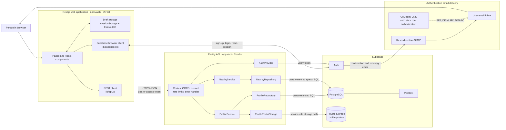

# Project architecture

**Status:** Implemented

**Last verified:** 2026-09-04

**Audience:** Contributors who need to understand Sia before changing it

## Purpose

This record explains how Sia is put together, where each major part lives, what each service owns,
and how data moves between those parts. It is intentionally written for people first: use it as the
starting map for the repository, then follow its links when implementation detail is needed.

Sia is a **pnpm monorepo** containing two deployable applications and two shared code packages. It is
not a collection of microservices. The backend is one modular Fastify API whose profile and Nearby
features are separated internally by service and repository boundaries.

## Architecture in one view

```text
Person using a browser
│
├── Sia web application — Next.js + React
│   Location: apps/web
│   Production host: Vercel
│   │
│   ├── Page and component UI
│   ├── Browser draft storage
│   │   ├── sessionStorage — unfinished profile fields
│   │   └── IndexedDB — unfinished profile photo
│   │
│   ├── Supabase browser client ───────────────► Supabase Auth
│   │   Purpose: sign-up, login, password reset, session/access token
│   │                                                  │
│   │                                                  └── custom SMTP ──► Resend
│   │                                                                       │
│   │                                                                       └──► Email inbox
│   │
│   └── REST client ─── HTTPS + JSON + bearer token ───► Sia API
│                                                        Location: apps/api
│                                                        Production host: Render
│                                                        │
│                                                        ├── Fastify routes and protections
│                                                        ├── AuthProvider
│                                                        │    └────────► Supabase Auth
│                                                        │              verifies access token
│                                                        ├── ProfileService
│                                                        │    ├────────► PostgreSQL profiles
│                                                        │    └────────► Supabase Storage
│                                                        │              private profile photos
│                                                        └── NearbyService
│                                                             └───────► PostgreSQL + PostGIS
│                                                                       location and meetings
│
├── @sia/validation — shared Zod contracts used by web and API
│   Location: packages/validation
│
└── @sia/shared — common API envelope and browser draft key
    Location: packages/shared

Delivery and verification
├── GitHub repository
├── GitHub Actions — install, test, type-check, and build
├── Vercel — Next.js deployment
├── Render — Dockerised Fastify API deployment
├── Resend — delivery transport for Supabase authentication email
├── GoDaddy DNS — sending-domain SPF, DKIM, MX and DMARC records
└── Supabase migrations — versioned database and storage setup
```

The most important trust boundary is the API. The browser may obtain a Supabase access token, but it
does not choose the authoritative `user_id` and does not query the application database directly.
The API verifies the token with Supabase Auth and derives ownership from the verified identity.

## Runtime interaction diagram



## Repository map

This tree focuses on architectural responsibilities instead of listing every UI file.

```text
project-sia/
├── apps/
│   ├── web/                         Browser and Next.js server application
│   │   ├── app/                     Routes, layouts, metadata and error/loading states
│   │   │   ├── create/              Pre-auth and authenticated profile creation
│   │   │   ├── login/               Sign-up, login and draft handoff
│   │   │   ├── profile/             Owner view, edit and QR experience
│   │   │   ├── nearby/              Authenticated Nearby entry point
│   │   │   └── u/[username]/        Anonymous public profile and social preview
│   │   ├── components/              Reusable UI and feature-level client behaviour
│   │   │   └── nearby-experience.tsx Browser location watch, polling and Nearby actions
│   │   ├── hooks/                   Authenticated owner-profile loading
│   │   ├── lib/
│   │   │   ├── api.ts               The only web-to-Sia-API client
│   │   │   ├── supabase.ts          Browser client for Supabase Auth only
│   │   │   ├── profile-photo-draft.ts IndexedDB draft-photo persistence
│   │   │   └── site.ts              Canonical site and SEO URL configuration
│   │   └── public/mascots/          Static profile/QR character artwork
│   │
│   └── api/                         Server-side REST application
│       ├── src/
│       │   ├── app.ts               Routes, middleware, dependency wiring and errors
│       │   ├── server.ts            Production composition root and HTTP listener
│       │   ├── config.ts            Validated server environment configuration
│       │   ├── auth/                Auth interface and Supabase implementation
│       │   ├── services/            Profile, photo and Nearby business rules
│       │   └── repositories/        Persistence interfaces and PostgreSQL implementations
│       └── Dockerfile               Portable multi-stage API image
│
├── packages/
│   ├── validation/                  Shared Zod schemas, domain types and validation tests
│   └── shared/                      API envelopes and the profile-draft storage key
│
├── supabase/migrations/             Ordered PostgreSQL, PostGIS and Storage changes
├── docs/                            Human-readable project knowledge
├── .github/workflows/ci.yml         Continuous verification on push and pull request
├── package.json                     Root commands and workspace orchestration
├── pnpm-workspace.yaml              apps/* and packages/* workspace definition
└── .env.example                     Browser-safe and server-only configuration contract
```

## Service and component responsibilities

### 1. Next.js web application

| Item | Detail |
| --- | --- |
| Location | [`apps/web`](../../apps/web) |
| Main role | Presents the product, manages browser interactions, and calls Auth or the Sia API |
| Framework | Next.js 15, React 19, TypeScript |
| Inputs | User actions, browser camera/geolocation, Supabase session, Sia API responses |
| Outputs | Auth requests, REST requests, profile/QR/Nearby UI, SEO metadata |
| Does not own | Authoritative identity, database writes, access control, or raw spatial queries |

The web application has both browser-rendered feature flows and Next.js server-rendered public
pages. Public profile pages fetch profile data from the same Fastify API and generate profile
metadata and structured data. The browser-side API wrapper keeps request headers and response/error
handling consistent.

Important entry points:

- [`app/create/page.tsx`](../../apps/web/app/create/page.tsx) builds a profile before or after login.
- [`app/login/page.tsx`](../../apps/web/app/login/page.tsx) handles authentication and saves a held
  draft after a session becomes available.
- [`app/profile`](../../apps/web/app/profile) contains owner view, editing, sharing and QR routes.
- [`app/u/[username]/page.tsx`](../../apps/web/app/u/%5Busername%5D/page.tsx) is the anonymous public
  profile route.
- [`components/nearby-experience.tsx`](../../apps/web/components/nearby-experience.tsx) owns the
  client-side geolocation and Nearby experience.
- [`lib/api.ts`](../../apps/web/lib/api.ts) defines every web call to the Fastify API.

### 2. Fastify API

| Item | Detail |
| --- | --- |
| Location | [`apps/api`](../../apps/api) |
| Main role | Enforces authentication, ownership, validation, privacy and business rules |
| Runtime | Node.js, Fastify 5, TypeScript; distributed as a Docker image |
| Inputs | JSON or multipart HTTP requests; optional/required bearer token by route |
| Outputs | Stable `{ data: ... }` successes or `{ error: { code, message } }` failures |
| Owns | All application database access and server-side photo-storage access |

[`app.ts`](../../apps/api/src/app.ts) is the HTTP boundary. It registers CORS, security headers,
multipart limits and rate limits; declares the V1 routes; authenticates protected requests; and
normalises errors. [`server.ts`](../../apps/api/src/server.ts) is the production composition root: it
loads validated configuration and supplies the concrete Supabase and PostgreSQL adapters.

The API is a modular monolith. `ProfileService` and `NearbyService` are internal modules inside the
same process, not separately deployed network services.

### 3. Profile service

| Item | Detail |
| --- | --- |
| Location | [`apps/api/src/services/profile-service.ts`](../../apps/api/src/services/profile-service.ts) |
| Main role | Create, read and update one profile per verified user |
| Rules | Full Zod validation, username uniqueness, owner lookup, public-only anonymous lookup |
| Collaborators | `ProfileRepository` and optional `ProfilePhotoStorage` |

It translates database uniqueness failures into stable product errors, merges and revalidates
profile patches, and attaches a short-lived signed photo URL to permitted profile responses. A photo
storage failure does not prevent the rest of a profile from loading.

### 4. Profile photo service

| Item | Detail |
| --- | --- |
| Location | [`apps/api/src/services/profile-photo-storage.ts`](../../apps/api/src/services/profile-photo-storage.ts) |
| Main role | Validate, sanitise, store, replace, delete and temporarily expose profile photos |
| Storage | Private Supabase Storage bucket named `profile-photos` by default |
| Limits | JPEG, PNG or WebP; maximum API upload size 5 MB |

The browser first crops a selected or captured image to a 512 × 512 WebP. The API still treats the
upload as untrusted: it checks the file signature, removes JPEG/PNG/WebP metadata that may contain
location or device information, and writes a new object under the verified user's folder. Stored
objects stay private; authorised profile responses receive a one-hour signed URL.

### 5. Nearby service

| Item | Detail |
| --- | --- |
| Location | [`apps/api/src/services/nearby-service.ts`](../../apps/api/src/services/nearby-service.ts) |
| Main role | Coordinate temporary, consent-based discovery and meeting flows |
| Spatial adapter | [`PostgresNearbyRepository`](../../apps/api/src/repositories/postgres-nearby-repository.ts) |
| Range | Candidates currently within 200 metres |

The browser watches the opted-in user's position. Movement updates are limited to at most one every
30 seconds, presence is refreshed on a 45-second heartbeat, and the Nearby snapshot is polled every
8 seconds. The API prunes expired temporary records opportunistically when snapshots are read.

PostGIS receives exact coordinates and calculates proximity and bearing. The public response is
deliberately less precise: it contains only one of three distance bands and one of eight direction
sectors. The feature uses preset Waves and coordination statuses rather than free-form chat.

### 6. Supabase Auth

| Item | Detail |
| --- | --- |
| Client use | The web client signs up, logs in, resets passwords and receives sessions |
| Server use | `SupabaseAuthProvider` verifies bearer tokens and returns the trusted user identity |
| Identity link | Supabase `auth.users.id` is referenced by the application tables |

The browser's public/anonymous Supabase key is configuration intended for browser use. The service
role key is server-only and must never appear in a `NEXT_PUBLIC_*` variable or browser bundle.

Supabase also owns authentication email workflows and template rendering. It passes confirmation
and password-reset messages to Resend through custom SMTP; the Sia application does not call Resend
directly.

### 7. Resend authentication email delivery

| Item | Detail |
| --- | --- |
| Main role | SMTP delivery for Supabase Auth confirmation and password-reset email |
| Integration point | Supabase Auth custom SMTP, configured outside the repository |
| Sending subdomain | `auth.siaqr.com` |
| DNS provider | GoDaddy; publishes Resend MX, SPF and DKIM plus the domain's DMARC policy |
| Application dependency | None: there is no Resend SDK or Resend API call in the web/API code |

Supabase creates the secure action link and renders the email template; Resend transports the
resulting message to the recipient. The visible sender is recorded as `Sia` using an address at
`@auth.siaqr.com`. Open and click tracking are disabled for this authentication flow. See the
dedicated [`authentication-email.md`](./authentication-email.md) record for configuration ownership,
DNS structure, validation status and safe maintenance guidance.

### 8. PostgreSQL and PostGIS

| Item | Detail |
| --- | --- |
| Schema source | [`supabase/migrations`](../../supabase/migrations) |
| Access path | Only the Fastify API, using parameterised SQL |
| PostgreSQL role | Profiles, Waves, connections, meeting state, blocks and reports |
| PostGIS role | Private point storage, 200 m searches, distance and bearing calculations |

Row Level Security is enabled on the application tables as defence in depth. V1 intentionally has
no browser-facing table policies because the browser does not perform application CRUD through the
Supabase data client.

### 9. Supabase Storage

The migration [`202609030001_add_profile_photos.sql`](../../supabase/migrations/202609030001_add_profile_photos.sql)
creates/configures the private photo bucket. Only the API uses the service credential to mutate it.
The `profiles.avatar_path` value stores an internal object path, not a permanent public URL.

### 10. Shared packages

| Package | Used by | Responsibility |
| --- | --- | --- |
| [`@sia/validation`](../../packages/validation) | Web and API | Zod schemas, domain types, username normalisation and allowed profile/Nearby values |
| [`@sia/shared`](../../packages/shared) | Web; available to workspace packages | Success/error envelope types and the browser profile-draft key |

Sharing validation prevents the UI and API from inventing different field shapes. The API still
validates every request authoritatively; browser validation is an earlier usability check, not a
security boundary.

### 11. Delivery services

| Service | Role | Repository evidence |
| --- | --- | --- |
| Vercel | Hosts the production Next.js application | Current deployment recorded in [`docs/project/overview.md`](../project/overview.md) |
| Render | Hosts the production Dockerised Fastify API | API [`Dockerfile`](../../apps/api/Dockerfile) and current deployment record |
| Supabase | Hosts Auth, PostgreSQL/PostGIS and private Storage | Client adapters, environment contract and migrations |
| Resend | Delivers Supabase Auth confirmation and recovery email over custom SMTP | [`authentication-email.md`](./authentication-email.md) |
| GoDaddy DNS | Authenticates the `auth.siaqr.com` sending domain using published DNS records | [`authentication-email.md`](./authentication-email.md) |
| GitHub Actions | Runs install, tests, type checks and builds on pushes and pull requests | [`.github/workflows/ci.yml`](../../.github/workflows/ci.yml) |

Vercel and Render are current hosting choices, not dependencies embedded throughout the application.
The web app can run on a Next.js-compatible host, and the API container can run on another
Docker-compatible host if its environment contract and network access are preserved.

## How the main product flows work

### Authentication email delivery

```text
Sign-up or forgotten-password action in the web app
→ Supabase Auth creates the secure action link
→ Supabase renders its configured Sia email template
→ Supabase submits the message to Resend over custom SMTP
→ Resend sends from the authenticated auth.siaqr.com subdomain
→ the recipient follows the link back to /login or /reset-password
```

Email template content lives in the Supabase Dashboard, not in Resend or this repository. Resend is
the delivery transport. The current integration covers sign-up confirmation and password recovery;
it is not yet a general product-notification or marketing-email service.

### Profile creation before registration

```text
1. Person completes the profile wizard in /create.
2. Web validation checks the draft using @sia/validation.
3. If there is no session:
   ├── profile fields go to sessionStorage
   ├── optional prepared photo goes to IndexedDB
   └── the browser moves to /login?from=create
4. Supabase Auth completes sign-up or login.
5. The web app sends the draft and access token to POST /api/v1/profiles.
6. The API verifies the token and uses its user_id as the owner.
7. ProfileService validates and ProfileRepository inserts into PostgreSQL.
8. If present, the photo is uploaded through the separate protected photo endpoint.
9. Browser draft data is cleared and the owner is sent to /profile.
```

No anonymous profile row is created. If email confirmation is enabled, the browser-held draft
survives until the person confirms their email and returns to log in.

### Returning owner and profile editing

```text
Browser session → GET /profiles/me with bearer token
                → AuthProvider verifies token
                → ProfileService looks up by verified user_id
                → PostgreSQL returns the owner row
                → photo service optionally adds a signed URL
                → owner UI renders
```

Edits use `PATCH /profiles/me`. The service merges the patch with the stored profile and validates
the complete result. A request body cannot redirect an edit to another owner.

### Public profile and QR sharing

```text
Owner profile → canonical URL /u/:username → QR generated in the browser
                                              │
Another person scans the QR ──────────────────┘
    → Next.js public-profile page
    → GET /public/profiles/:username without authentication
    → API returns the profile only when is_public = true
```

The QR code encodes the canonical profile URL and is generated on demand; it is not stored as a
file or database row. Missing and private profiles intentionally return the same not-found response
so the API does not reveal whether a private username exists.

### Profile photo update

```text
Device image/camera
→ browser crop and 512 × 512 WebP preparation
→ multipart request with bearer token
→ API size and file-signature validation
→ metadata removal
→ private Supabase Storage object
→ profiles.avatar_path updated
→ previous object removed
→ one-hour signed URL returned
```

### Nearby discovery and meeting

```text
Explicit opt-in
→ browser geolocation watch
→ PUT /nearby/presence with bearer token
→ exact point stored temporarily in PostGIS
→ spatial search finds active people within 200 m
→ API converts exact result to distance band + direction sector
→ browser displays candidates
→ preset Wave
→ recipient accepts
→ temporary two-hour connection
→ optional time/place Meet Card
→ preset coordination updates
→ expiry or block closes/removes temporary interaction data
```

Nearby is hidden by default. `DELETE /nearby/presence` immediately removes the user's location.
Blocks suppress both directions of discovery and close active interactions. Reports are retained as
moderation evidence even though transient Nearby data expires.

## API layering and dependency direction

```text
HTTP request
    ↓
Fastify route              Transport, token extraction, request/response envelope
    ↓
AuthProvider               Trusted identity from Supabase access token
    ↓
ProfileService /           Business rules, privacy rules, authoritative validation
NearbyService
    ↓
Repository interface       Provider-independent persistence contract
    ↓
PostgreSQL implementation  Parameterised SQL and transactions
    ↓
Supabase PostgreSQL/PostGIS
```

The route and service layers depend on interfaces. Provider-specific code is isolated in
`SupabaseAuthProvider`, `PostgresProfileRepository`, `PostgresNearbyRepository`, and
`SupabaseProfilePhotoStorage`. This makes the core logic testable with fake implementations and
keeps a future provider change localised.

## Data ownership and relationships

```text
Supabase auth.users
├── 1 ── 0..1 profiles
├── 1 ── 0..1 nearby_presence
├── 1 ── many nearby_signals (sender or recipient)
├── 1 ── many nearby_connections (user A or user B)
├── 1 ── many nearby_blocks (blocker or blocked)
└── 1 ── many nearby_reports (reporter or reported)

nearby_connections
└── 1 ── many nearby_meet_plans
              └── 1 ── many nearby_meet_statuses

profiles.avatar_path ── logical reference ──► private Supabase Storage object
```

| Data | Authoritative owner | Retention behaviour |
| --- | --- | --- |
| Account and session | Supabase Auth | Controlled by Auth configuration/account lifecycle |
| Auth email templates and action links | Supabase Auth | Managed in Supabase; confirmation/recovery links are short-lived |
| Auth email transport and delivery events | Resend | Managed under the Resend account and its retention settings |
| Email-domain authentication | GoDaddy DNS | Persists until DNS records are changed or removed |
| Profile | PostgreSQL `profiles` | Persists; cascades when the Auth user is deleted |
| Profile photo | Private Supabase Storage | Replaced or removed by API; path stored in profile |
| Exact Nearby presence | PostgreSQL/PostGIS | Expires and is opportunistically pruned; explicit hide deletes immediately |
| Waves and connections | PostgreSQL | Temporary and pruned after expiry |
| Meet plans and statuses | PostgreSQL | Temporary; tied to connection/plan lifecycle |
| Blocks | PostgreSQL | Retained for safety |
| Reports | PostgreSQL | Retained as moderation evidence |
| Unfinished profile fields | Browser `sessionStorage` | Current tab/session until saved or cleared |
| Unfinished profile photo | Browser IndexedDB | Until saved or cleared by the create/login flow |

See [`docs/database/schema.md`](../database/schema.md) for column-level details.

## Security and privacy boundaries

- Protected API routes require a Supabase bearer token and derive `user_id` from the verified token.
- Browser code never receives `SUPABASE_SERVICE_ROLE_KEY` or `DATABASE_URL`.
- Resend SMTP/API credentials stay in managed Supabase/Resend configuration and are not committed.
- The configured `WEB_ORIGIN` is the only allowed CORS origin.
- Helmet adds security headers; global and sensitive-route rate limits constrain abuse.
- Zod validates incoming profile and Nearby data; PostgreSQL constraints add defence in depth.
- SQL is parameterised through the `postgres` client.
- Profile photos are private, signature-checked and metadata-stripped before storage.
- Private and nonexistent profiles share the same public `404` behaviour.
- Nearby endpoints send `Cache-Control: no-store` and keep raw coordinates, raw distance and exact
  bearing out of responses.
- RLS is enabled even though all application data access currently flows through the API.
- Unexpected errors are logged server-side and returned without stack traces or credentials.

## Configuration boundaries

### Web application configuration

| Variable | Purpose |
| --- | --- |
| `NEXT_PUBLIC_SUPABASE_URL` | Supabase project URL used by the browser Auth client |
| `NEXT_PUBLIC_SUPABASE_ANON_KEY` | Browser-safe Supabase anonymous/publishable key |
| `NEXT_PUBLIC_API_URL` | Fastify V1 API base URL |
| `NEXT_PUBLIC_SITE_URL` | Canonical origin used for public links, QR codes and SEO |
| `GOOGLE_SITE_VERIFICATION` / `BING_SITE_VERIFICATION` | Optional web build/runtime values for search ownership metadata |

Only the `NEXT_PUBLIC_*` values are available to browser code. The verification values support
Next.js metadata generation and do not need to be exposed as public browser variables.

### API-only configuration

| Variable | Purpose |
| --- | --- |
| `SUPABASE_URL` | Supabase endpoint used by server adapters |
| `SUPABASE_SERVICE_ROLE_KEY` | Server-only Auth/Storage credential |
| `PROFILE_PHOTO_BUCKET` | Private photo bucket; defaults to `profile-photos` |
| `DATABASE_URL` | PostgreSQL connection used by both repositories |
| `WEB_ORIGIN` | Exact permitted browser origin |
| `PORT`, `HOST`, `LOG_LEVEL` | API runtime settings |

### Managed authentication-email configuration

| System | Configuration it owns |
| --- | --- |
| Supabase Auth | Custom SMTP credential, sender, email templates, Site URL and allowed redirects |
| Resend | Verified `auth.siaqr.com` sending domain, SMTP transport, tracking and delivery information |
| GoDaddy DNS | MX, SPF and DKIM for the Resend sending domain plus DMARC for domain protection |

These values are configured in provider dashboards rather than `.env.example`. In particular, the
application does not need a `RESEND_API_KEY` because it does not call Resend directly.

The checked-in contract is [`.env.example`](../../.env.example). Real credentials must remain in
local untracked environment files or deployment secret stores.

## Build, test and deployment path

```text
Developer change
→ pnpm workspace commands
→ Git push / pull request
→ GitHub Actions
   ├── pnpm install --frozen-lockfile
   ├── pnpm test
   ├── pnpm typecheck
   └── pnpm build
→ web deployment on Vercel
→ API Docker deployment on Render
→ versioned Supabase migrations applied separately with Supabase tooling
```

The root scripts build shared packages before the applications that consume them. API route tests
use fake Auth, repository and storage implementations, so they do not need live Supabase secrets.
Validation schemas have focused tests. The web package currently has no component test suite and
uses `vitest --passWithNoTests`.

Database migrations are part of the deployable architecture but are not applied by the current CI
workflow. They must be applied to the target Supabase project through the documented deployment or
local setup process.

Supabase Auth templates, custom SMTP settings, Resend configuration and GoDaddy DNS are also outside
the current GitHub Actions deployment path. Changes to them require a separate operational check and
should be recorded in [`authentication-email.md`](./authentication-email.md).

## Where to make common changes

| Desired change | Start here | Usually also check |
| --- | --- | --- |
| Add or change a profile field | `packages/validation/src/profile.ts` | Profile service/repository, migration, form/card UI, API and database docs |
| Add a web page | `apps/web/app/` | Layout/metadata, navigation, robots/sitemap when public |
| Change an API endpoint | `apps/api/src/app.ts` | `apps/web/lib/api.ts`, validation schemas, API tests and API docs |
| Change profile business rules | `apps/api/src/services/profile-service.ts` | Shared validation and repository constraints |
| Change Nearby behaviour | `nearby-service.ts` and `nearby-experience.tsx` | Nearby repository, validation, migration/schema and privacy guarantees |
| Change a database table | `supabase/migrations/` | Repository queries, shared types, schema docs and deployment steps |
| Change authentication provider | `apps/api/src/auth/auth-provider.ts` boundary | Browser login integration and account-to-table foreign keys |
| Change authentication email wording | Supabase Auth email templates | Preserve secure template variables and test both auth flows |
| Change authentication email delivery | Supabase custom SMTP and Resend | GoDaddy DNS, sender domain, tracking settings and an inbox smoke test |
| Change database provider | Repository interfaces/implementations | Transactions, PostGIS requirements and migrations |
| Change photo storage | `ProfilePhotoStorage` boundary | Bucket migration, sanitisation, signed-URL policy and upload UI |
| Change hosting | Deployment configuration | Environment variables, CORS, canonical URL and HTTPS geolocation |

## New contributor reading order

1. Read [`docs/project/overview.md`](../project/overview.md) for the product and current delivery
   state.
2. Read this record for the system map and trust boundaries.
3. Run the project using [`docs/development/local-development.md`](../development/local-development.md).
4. Use [`docs/api/v1.md`](../api/v1.md) and [`docs/database/schema.md`](../database/schema.md) when
   working across the web/API/database boundary.
5. Open the shared validation schema before changing a domain field.
6. Follow one complete request from `apps/web/lib/api.ts` to `apps/api/src/app.ts`, then into its
   service and repository. That path shows the repository's normal dependency direction.

## Architectural decisions and deliberate exclusions

- A modular monolith is sufficient for V1; profile and Nearby modules share one API process.
- The Fastify API is the single application-data gateway.
- Public profiles use `/u/:username`; QR assets encode that canonical URL and are generated on
  demand.
- A profile can be prepared before account creation without creating anonymous server data.
- Profiles default to private, and each Auth user can own only one profile.
- Nearby prioritises consent, approximate disclosure and expiry over continuous social networking.
- V1 has no message queue, event bus, cache service, cron worker, map provider, payments service,
  AI service, push-notification service or admin application.
- V1 has no application-level email client: authentication mail follows Supabase Auth → Resend SMTP.
- Expired Nearby cleanup is request-driven rather than a separate scheduled worker.

These exclusions are useful when reading the tree: if a flow is not shown going through another
service, that service does not currently exist in the project.

## Known architecture limitations

- The Next.js application has no component-level automated tests yet.
- Nearby snapshot updates use 8-second polling rather than server push or WebSockets.
- Expired Nearby data is pruned opportunistically by API traffic, not by a guaranteed scheduled job.
- Reports are stored but there is no moderation/admin interface to review them.
- There is no account deletion or data export flow in the application UI.
- Public profiles are indexable, but the sitemap currently lists only `/` and `/create` rather than
  enumerating profile URLs.
- The Resend/Supabase configuration is external to Git, and a completed end-to-end production inbox
  smoke test has not yet been recorded.

These are current facts, not hidden services or unrecorded promises. Planned work belongs in
[`docs/project/roadmap.md`](../project/roadmap.md).

## Validation and source basis

This record was checked against the repository structure, workspace manifests, web API client,
authentication flow, API route composition, service and repository implementations, migrations,
Dockerfile, CI workflow, environment example, and the existing architecture/API/database/project
documents on 2026-09-04. The Resend boundary was additionally checked against the earlier project
task that configured GoDaddy DNS, Resend, Supabase custom SMTP, redirects and email templates; public
MX/SPF/DKIM/DMARC record presence was rechecked on the same date.

Primary detailed references:

- [`docs/architecture/system.md`](../architecture/system.md)
- [`docs/architecture/backend.md`](../architecture/backend.md)
- [`docs/api/v1.md`](../api/v1.md)
- [`docs/database/schema.md`](../database/schema.md)
- [`docs/development/local-development.md`](../development/local-development.md)

Focused implementation and operations records:

- [`deployment-and-domain.md`](./deployment-and-domain.md)
- [`authentication.md`](./authentication.md)
- [`authentication-email.md`](./authentication-email.md)
- [`nearby-privacy.md`](./nearby-privacy.md)
- [`profile-photos.md`](./profile-photos.md)
- [`qr-and-personalisation.md`](./qr-and-personalisation.md)
- [`capacity-and-scaling.md`](./capacity-and-scaling.md)
- [`testing-and-release.md`](./testing-and-release.md)

## Change history

| Date | Change |
| --- | --- |
| 2026-09-04 | Added Resend and GoDaddy DNS to the authentication-email architecture and linked the dedicated operational record. |
| 2026-09-04 | Created the consolidated, human-readable architecture record and linked it from the project-record index. |
