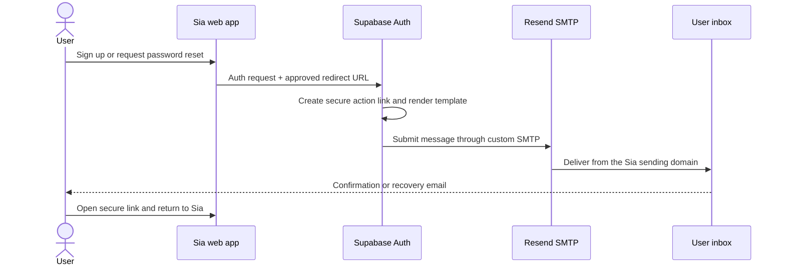

# Authentication email delivery

**Status:** Configured; end-to-end inbox smoke test still to be recorded

**Last verified:** 2026-09-04

**Audience:** Contributors maintaining sign-up confirmation and password-reset email delivery

## Purpose and user outcome

Sia uses email during account creation and password recovery. A user should receive a recognisable
Sia-branded message from Sia's own email subdomain, follow its secure link, and return to the correct
page on `https://siaqr.com`.

This is an **authentication-email pipeline**, not a general application email service. The current
application does not import the Resend SDK, call the Resend API, or send newsletters, product
notifications, or marketing messages.

## Architecture in one view

```text
Sia web app
│
├── New account
│   └── supabase.auth.signUp(... emailRedirectTo: https://siaqr.com/login)
│
└── Forgotten password
    └── supabase.auth.resetPasswordForEmail(... redirectTo: https://siaqr.com/reset-password)
         │
         ▼
Supabase Auth
├── creates the secure confirmation/recovery link
├── selects and renders the email template
└── sends through configured custom SMTP
         │
         ▼
Resend
├── SMTP delivery provider
├── sends as Sia from @auth.siaqr.com
└── uses the domain-authentication records published in GoDaddy DNS
         │
         ▼
User's email provider and inbox
         │
         ▼
Secure link returns to siaqr.com/login or siaqr.com/reset-password
```



## What each service owns

| Component | Responsibility | Where it is managed |
| --- | --- | --- |
| Sia web app | Starts sign-up and password-reset requests and supplies the return URL | [`apps/web/app/login/page.tsx`](../../apps/web/app/login/page.tsx) |
| Supabase Auth | Account workflow, secure action link, template selection/rendering and SMTP handoff | Supabase Dashboard → Authentication |
| Resend | SMTP transport, sending-domain verification and delivery visibility | Resend Dashboard |
| GoDaddy DNS | Publishes the SPF, DKIM, return-path/MX and DMARC records used to authenticate Sia mail | GoDaddy DNS for `siaqr.com` |
| Recipient mail provider | Applies its own filtering and places the message in the inbox or spam folder | Outside Sia's control |

The division between Supabase and Resend is important: **email wording is edited in Supabase;
Resend delivers the resulting message.** Changing a Resend setting does not change the email body.

## Current configuration record

| Setting | Recorded value |
| --- | --- |
| Website origin | `https://siaqr.com` |
| Dedicated sending subdomain | `auth.siaqr.com` |
| Visible sender name | `Sia` |
| Recorded sender example | `Sia <account@auth.siaqr.com>` |
| Resend SMTP host | `smtp.resend.com` |
| Resend SMTP port | `465` |
| Resend SMTP username | `resend` |
| SMTP client | Supabase Auth custom SMTP |
| Supabase Site URL | `https://siaqr.com` |
| Confirmation return URL | `https://siaqr.com/login` |
| Password-reset return URL | `https://siaqr.com/reset-password` |
| Resend open tracking | Off for authentication emails |
| Resend click tracking | Off for authentication emails |

The SMTP password/API key is secret and is intentionally not recorded in this repository. It is
held in the managed Supabase/Resend configuration.

## Sending-domain and DNS design

Sia uses `auth.siaqr.com` as a sending subdomain rather than sending authentication messages from
the website root. This gives the mail an explicit purpose and separates authentication-email
reputation from future email categories.

```text
siaqr.com                         Website/root domain
└── auth.siaqr.com                Visible authentication sending domain
    ├── send.auth.siaqr.com       Resend return path; MX and SPF records
    └── resend._domainkey...      DKIM public key used to verify Resend signatures

_dmarc.siaqr.com                  Root DMARC policy inherited/used for domain protection
```

The following public DNS record groups were present when rechecked on 2026-09-04:

- MX for `send.auth.siaqr.com`
- SPF/TXT for `send.auth.siaqr.com`
- DKIM/TXT for `resend._domainkey.auth.siaqr.com`
- DMARC/TXT for `_dmarc.siaqr.com`

The exact DNS values are deliberately not copied here. Resend is the source of truth for the values
expected by the active account, and GoDaddy is the source of truth for what is published. Copying
the long records into project documentation would create a stale second source.

Do not replace these records merely because a newly created Resend domain displays different
values. A mismatch can mean the DNS was created from a different Resend account or domain object;
identify the active configuration before changing live DNS.

## Email types currently used

### Confirm signup

The web app calls `supabase.auth.signUp` and supplies `https://siaqr.com/login` as the email return
location. If Supabase email confirmation is enabled, Supabase sends the confirmation message through
Resend. After the user returns and signs in, Sia saves any profile draft held in the browser.

### Reset password

The web app calls `supabase.auth.resetPasswordForEmail` and supplies
`https://siaqr.com/reset-password` as the return location. The reset page then updates the password
through Supabase Auth.

### Not currently used by the Sia application

- Magic-link login
- User invitations
- Change-email messages initiated by a Sia UI
- Reauthentication emails initiated by a Sia UI
- Product notifications, newsletters or marketing campaigns

Supabase may show templates for these message types, but their presence in its Dashboard does not
mean the current application calls them.

## Template ownership

Authentication email subjects and HTML bodies live in:

```text
Supabase Dashboard
└── Authentication
    └── Email
        └── Templates
            ├── Confirm signup
            └── Reset password
```

The previous configuration work prepared Sia-branded confirmation and reset templates. Secure
template variables such as `{{ .ConfirmationURL }}` must remain intact: Supabase replaces them with
the real, short-lived action URL when it renders a message.

Because the templates and SMTP settings are managed outside Git, a repository checkout cannot show
their current production contents. When changing copy, preserve a reviewed copy or summary in a
project record so future contributors can understand what changed.

## Application implementation locations

| Behaviour | Location |
| --- | --- |
| Supabase browser client | [`apps/web/lib/supabase.ts`](../../apps/web/lib/supabase.ts) |
| Sign-up request and `/login` return URL | [`apps/web/app/login/page.tsx`](../../apps/web/app/login/page.tsx) |
| Password-reset request and `/reset-password` return URL | [`apps/web/app/login/page.tsx`](../../apps/web/app/login/page.tsx) |
| Password update after following the recovery link | [`apps/web/app/reset-password/page.tsx`](../../apps/web/app/reset-password/page.tsx) |
| Canonical site environment contract | [`.env.example`](../../.env.example) |
| Broader authentication boundary | [`architecture.md`](./architecture.md) |

There is no Resend package in `package.json` and no Resend environment variable in `.env.example`.
That is expected for the current design because Supabase, not Sia application code, is the SMTP
client.

## Security and deliverability rules

- Never commit or document the Resend API key/SMTP password.
- Keep the sender address inside the verified `auth.siaqr.com` domain.
- Keep SPF, DKIM and DMARC valid; verify changes in both Resend and public DNS.
- Keep open and click tracking disabled for authentication email. Link rewriting can interfere with
  secure action links and is unnecessary for this flow.
- Keep production redirect URLs exact and HTTPS-based.
- Preserve Supabase's secure template variables instead of constructing confirmation tokens in HTML.
- Test both inbox and spam placement after DNS, sender, template or SMTP changes.
- Do not route product/marketing mail through this authentication subdomain without an explicit
  architecture decision.

## Operational validation

The earlier Resend configuration task recorded these completed checks:

- GoDaddy DNS and the Resend domain showed a successful connection.
- Resend was connected to Supabase Auth as custom SMTP.
- The sender, SMTP host, port and username were reviewed in Supabase.
- Supabase Site URL and the two application redirect URLs were configured.
- Resend open and click tracking were confirmed off.
- The production `/login` page responded successfully before the planned delivery test.
- Sia-branded Confirm signup and Reset password template copy was prepared in Supabase.

The final new-account inbox smoke test was requested but its result was not recorded; the automated
attempt stopped because the Codex task reached its usage limit. Therefore this record does not claim
that production inbox delivery or the full link-return flow has been proven.

## Recommended smoke test

Use an email address that has not previously registered:

1. Open `https://siaqr.com/login` in a private browser window.
2. Create an account and confirm that the message arrives from `Sia` at an `@auth.siaqr.com`
   address.
3. Open the confirmation link and verify that it returns to Sia's login flow.
4. Complete login and confirm that any pre-auth profile draft is saved.
5. Sign out, request a password reset, and verify that the recovery message arrives.
6. Open its link, confirm that `/reset-password` loads, choose a new password, and log in with it.
7. Record the date, result, sender address, inbox/spam placement and any delivery delay below.

Do not record test passwords, secure links, message tokens, API keys or SMTP credentials.

## Known limitations

- SMTP/domain/template configuration is external to the repository and can drift without a code
  change.
- There is no automated production authentication-email smoke test.
- The completed end-to-end signup and password-reset delivery result has not yet been recorded.
- Resend currently serves authentication mail only; adding application-generated email will require
  a new implementation and secrets/configuration design.

## Change history

| Date | Change |
| --- | --- |
| 2026-09-04 | Created this record from the prior Resend configuration task, current source code, and a fresh presence check of the public MX/SPF/DKIM/DMARC DNS record groups. |
